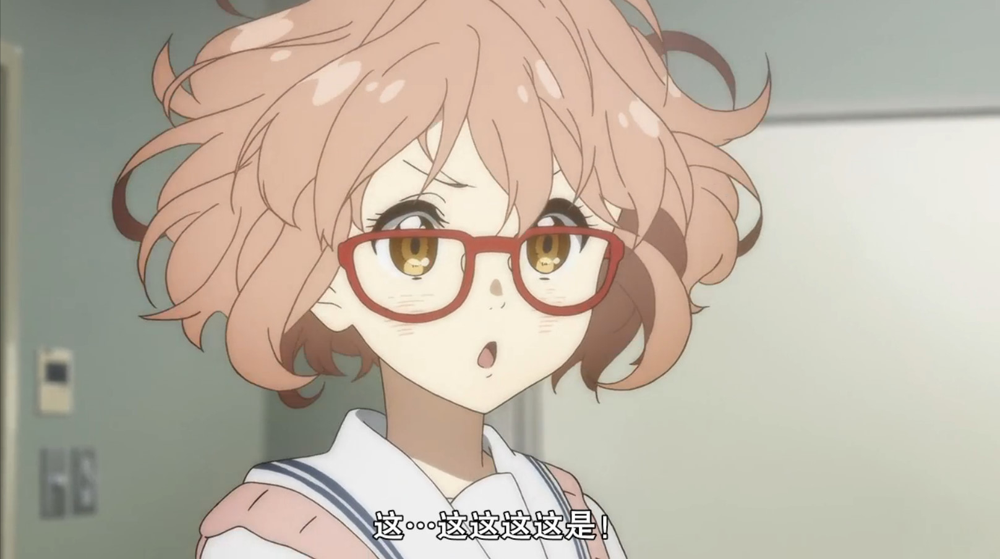
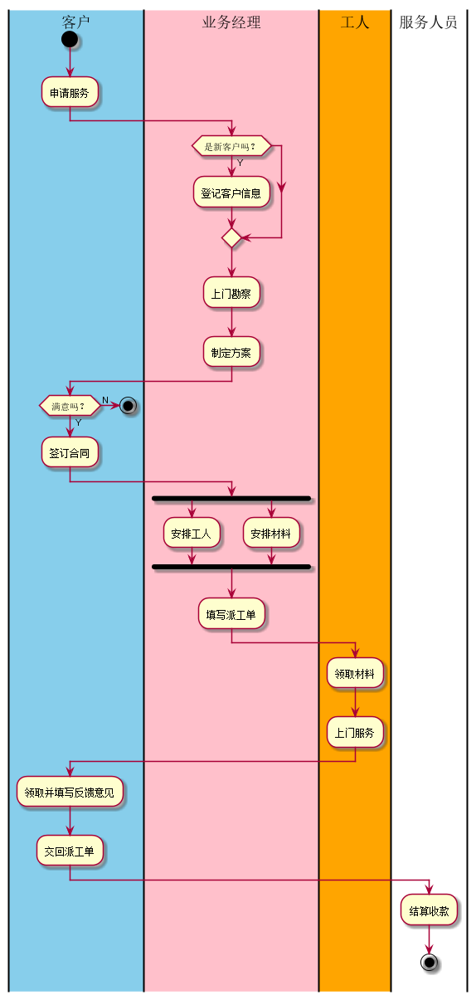

# 实验1：业务流程建模
|学号|班级|姓名|照片|
|:-------:|:-------------: | :----------:|:---:|
|201510414123|软件(本)15-1|吴艳芳||

## 流程图1：考试及成绩管理流程

**PlantUML源码如下：**

``` flow1
@startuml
|#skyblue|教务处|
start
:安排考试;
:安排考试表>
|教务处|
|教师|
:出卷;
fork
    :A,B试卷;
|教师|
fork again
|#pink|系主任|
    :打印审批表;
    :审批签字;
    :打印审批表;
|系主任|
end fork
|教务处|
:打印试卷;
:试卷;
|教务处|
|学生|
:参加考试;
:答卷;
|学生|
|教师|
:阅出成绩;
fork
    :成绩单;
fork again
    :答卷;
    :装订成档;
|教师|
|教务处|
    if( 有不及格？ )then( 有 )
        :安排补考;
    endif
    :安排补考表;
|教务处|
end fork
stop
@enduml
```

**业务流程图如下：**


## 流程图2： 客户维修服务流程

**PlantUML源码如下：**

``` flow2
@startuml
|#skyblue|客户|
start
:申请服务;
|客户|
|#pink|业务经理|
if( 是新客户吗？ )then( Y )
    :登记客户信息;
    endif
:上门勘察;
:制定方案;
|业务经理|
|客户|
    if( 满意吗？ )then( Y )
        :签订合同;
|客户|
        fork
|业务经理|
             :安排工人;
        fork again
            :安排材料;
        end fork
        :填写派工单;
|业务经理|
|#orange|工人|
        :领取材料;
        :上门服务;
|工人|
|客户|
        :领取并填写反馈意见;
        :交回派工单;
|客户|
|服务人员|
        :结算收款;
        stop
|服务人员|
|客户|
    else( N )
        stop
|客户|
@enduml
```

**业务流程图如下：**


