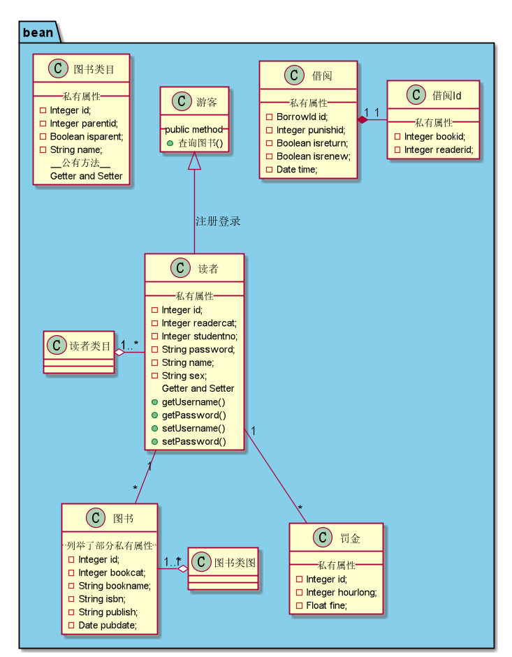
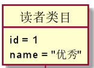
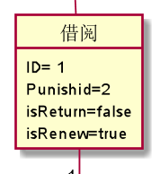
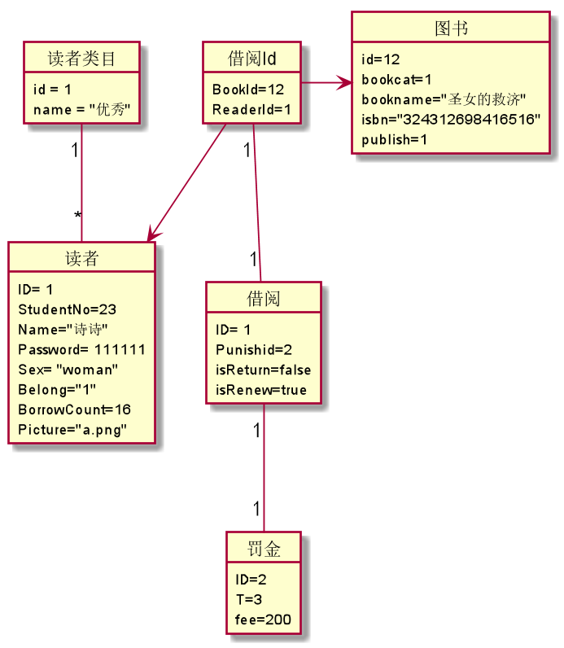

# 实验3：图书管理系统领域对象建模
|学号|班级|姓名|照片|
|:-------:|:-------------: | :----------:|:---:|
|201510414123|软件(本)15-1|吴艳芳| |

## 1. 图书管理系统的类图

### 1.1 类图PlantUML源码如下：

``` class
@startuml
scale 750 width
package bean <<Folder>> #skyblue{
  借阅 "1" *- "1" 借阅Id
  读者 "1"-- "*" 图书
  读者类目 "1" o- "1..*" 读者
  图书类图 "1" o- "1..*" 图书
  读者 "1"--"*" 罚金
  游客 <|-- 读者 : 注册登录
  class 图书{
  ..列举了部分私有属性..
  	- Integer id;
  	- Integer bookcat;
  	- String bookname;
  	- String isbn;
  	- String publish;
  	- Date pubdate;
  }
  class 借阅Id{
  __私有属性__
    - Integer bookid;
    - Integer readerid;
  }
  class 罚金{
  __私有属性__
  - Integer id;
  - Integer hourlong;
  - Float fine;
  }
  class 图书类目{
  __私有属性__
    - Integer id;
    - Integer parentid;
    - Boolean isparent;
    - String name;
    __公有方法__
    Getter and Setter
  }
  class 借阅{
  __私有属性__
    - BorrowId id;
    - Integer punishid;
    - Boolean isreturn;
    - Boolean isrenew;
    - Date time;
  }
  class 读者{
  __私有属性__
  	- Integer id;
  	- Integer readercat;
  	- Integer studentno;
  	- String password;
  	- String name;
  	- String sex;
  			..Getter and Setter..
    		+ getUsername()
     		+ getPassword()
     		+ setUsername()
     		+ setPassword()
  }
  class 游客 {
  		__ public method __
  		+查询图书()
  	}
}

@enduml
```

### 1.2. 类图如下：



### 1.3. 类图说明：
book图书类，bookcat图书类目类，reader读者类，readercat读者类目类
borrow图书借阅类，borrowId图书借阅id类，punish罚金类
一个图书类目下允许有多个图书，一个读者类目下允许有多个读者
读者和图书的借阅关系是多对多，通过“借阅类”这个中间类来实现多对多，
罚金和读者的关系是多对一


## 2. 图书管理系统的对象图
### 2.1 类读者类目的对象图
#### 源码如下：
``` class
object 读者类目 {
  id = 1
  name = "优秀"
}
``` 
#### 对象图如下：


### 2.2 类对读者的对象图
#### 源码如下：
``` class
object 读者{
    ID= 1
    StudentNo=23
    Name="诗诗"
    Password= 111111
    Sex= "woman"
    Belong="1"
    BorrowCount=16
    Picture="a.png"

}
``` 
#### 对象图如下：


### 2.3 类图书的对象图
#### 源码如下：
```class
object 图书{
  	id=12
  	bookcat=1
  	bookname="圣女的救济"
  	isbn="324312698416516"
  	publish=1
}
```
#### 对象图如下：


### 2.4 类借阅的对象图
#### 源码如下：
```class
object 借阅{
  ID= 1
  Punishid=2
  isReturn=false
  isRenew=true
}
```
#### 对象图如下：


### 2.5 类借阅Id的对象图
#### 源码如下：
```class
object 借阅Id{
  BookId=12
  ReaderId=1
}
```

#### 对象图如下：


### 2.7 对象们的关系图:


