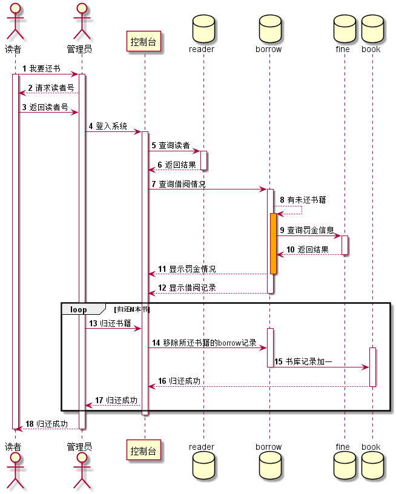

# 实验4：图书管理系统顺序图绘制
|学号|班级|姓名|照片|
|:-------:|:-------------: | :----------:|:---:|
|201510414123|软件(本)15-1|吴艳芳|null |

## 1. 查询图书用例

### 1.1 查询图书时序图PlantUML源码

``` class
@startuml
autonumber
actor 读者或游客 as dy
participant 控制台 as c
database bookcat
database book
dy->c:输入网址，进入
activate dy
activate c
c->bookcat:请求加载图书类目
activate bookcat
bookcat-->c:返回图书类目
deactivate bookcat
loop 查询N次
    c->book:查询书籍
    activate book
    book-->c:显示书籍信息
end
deactivate book
note right:读者或游客大多数都会不止查询一次
c-->dy:退出控制台
deactivate c
deactivate dy
@enduml
```

### 1.2. 查询图书用例时序图


### 1.3. 查询图书用例时序图说明：

读者和游客都可以查询图书，而且不需要登陆，只要访问到网站就行
系统先查询书籍类目并显示，然后访客在选择需要的类目，系统再查
询出该类目下的书籍


## 2. 读者查询自身借阅情况用例时序图
### 2.1 读者查询自身借阅情况用例PlantUML源码
``` class
@startuml
autonumber
actor 读者 as d
participant 控制台 as c
database borrow
database fine
d->c:登陆系统
activate d
activate c
c->borrow:查询借阅情况
activate borrow
borrow-->borrow:有未还书籍
activate borrow #orange
borrow->fine:查询罚金信息
activate fine
fine-->borrow:返回结果
deactivate fine
borrow-->c:显示罚金情况
deactivate borrow
borrow-->c:显示借阅记录
deactivate borrow
c-->d:退出系统
deactivate c
deactivate d
@enduml
``` 
### 2.2. 读者查询自身借阅情况用例时序图


### 2.3. 读者查询自身借阅情况用例时序图说明：

读者登陆系统后查询自身借阅书籍的历史记录，系统通过borrow,fine得到
结果，并在前台页面显示结果


## 3. 读者借书用例时序图

### 3.1 读者借书用例时序图PlantUML源码

```class
@startuml
autonumber
actor 读者 as d
actor 管理员 as g
participant 控制台 as c
database reader as r
database borrow as b
database book
d->g:请求借书
activate d
note left:告诉管理员要借阅的所有书籍
activate g
g-->d:请求读者号
d->g:返回
g->c:登入系统
activate c
c->r:查询读者
activate r
r-->c:返回读者号
deactivate r
note right:要先找到该读者，才能找到该\n读者的borrow并进行操作
loop 执行N次
c->b:借阅书籍
activate b
b->book:增加借阅记录，书库数量减一
activate book
book-->b:success
deactivate book
b-->c:借阅成功
end
deactivate b
c-->g:所有书籍借阅成功
deactivate c
g-->d:所有书籍借阅成功
deactivate g
deactivate d
@enduml
```
### 3.2. 读者借书用例时序图


### 3.3. 读者借书用例时序图说明：

book图书类，reader读者类，borrow图书借阅类，fine罚金类
读者进入图书馆后找管理员提出借书要求，管理员登陆系统然后首先根据读者的id
查询到reader，查询界面会显示该读者已经借阅的书籍，如果有超时未归还的
书籍，页面上会显示出来，提醒管理员向读者索取罚金，读者缴纳罚金后，
再查询借阅书籍，若库存足够则借阅成功

## 4. 读者还书用例时序图

### 4.1 读者还书用例时序图PlantUML源码

```class
@startuml
autonumber
actor 读者 as d
actor 管理员 as g
participant 控制台 as c
database reader
database borrow
database fine
database book
d->g:我要还书
activate d
activate g
g-->d:请求读者号
d->g:返回读者号
g->c:登入系统
activate c
c->reader:查询读者
activate reader
reader-->c:返回结果
deactivate reader
c->borrow:查询借阅情况
activate borrow
borrow-->borrow:有未还书籍
activate borrow #orange
borrow->fine:查询罚金信息
activate fine
fine-->borrow:返回结果
deactivate fine
borrow-->c:显示罚金情况
deactivate borrow
borrow-->c:显示借阅记录
deactivate borrow
loop 归还N本书
g->c:归还书籍
activate borrow
c->borrow:移除所还书籍的borrow记录
activate book
borrow->book:书库记录加一
deactivate borrow
book-->c:归还成功
deactivate book
c-->g:归还成功
end
deactivate c
g-->d:归还成功
deactivate g
deactivate d
@enduml
```
### 4.2. 读者还书用例时序图


### 4.3. 读者还书用例时序图说明：

读者来归还书籍,管理员登入系统然后询问读者的id，调用控制台
根据id查询到读者,再查询读者所借阅书籍，若有超时未归还则让
读者缴纳罚金，成功缴纳后则归还书籍，borrow删除记录，punish
删除记录，图书库存加一

