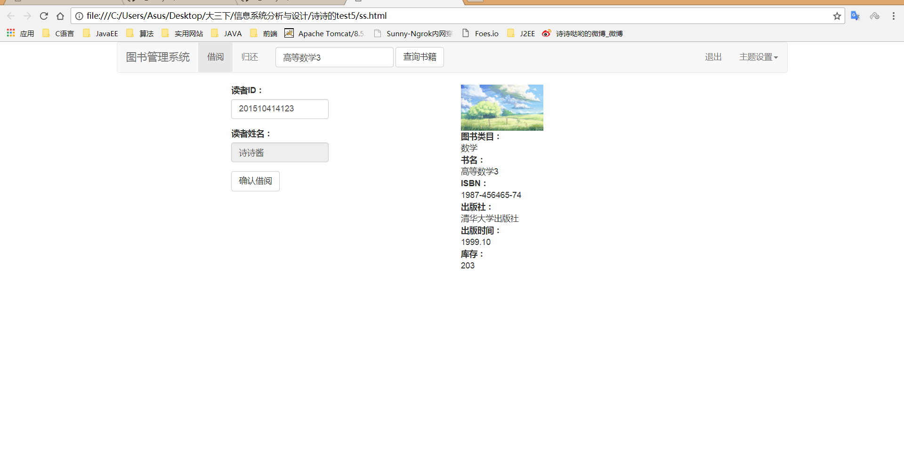

# 实验5：图书管理系统数据库设计与界面设计
|学号|班级|姓名|照片|
|:-------:|:-------------: | :----------:|:---:|
|201510414123|软件(本)15-1|吴艳芳||

## 1.数据库表设计

## 1.1. 图书表
|字段|类型|主键，外键|可以为空|默认值|约束|说明|
|:-------:|:-------------:|:------:|:----:|:---:|:----:|:-----|
|id|int(100)|主键|否||||
|bookCat|varchar2(100)| |否||||
|bookName|varchar2(100)| |否||||
|isbn|varchar2(100)| |否||||
|publish|varchar2(100)| |是||||
|pubdate|data| |是||||

## 1.2. 图书类目表
|字段|类型|主键，外键|可以为空|默认值|约束|说明|
|:-------:|:-------------:|:------:|:----:|:---:|:----:|:-----|
|id|int(100)|主键|否||||
|parentid|int(10)| |否|||该类目从属哪个父类|
|isparent|int(10)| |否|||该类目是否包含子类目|

## 1.3. 读者表
|字段|类型|主键，外键|可以为空|默认值|约束|说明|
|:-------:|:-------------:|:------:|:----:|:---:|:----:|:-----|
|id|varchar2(100)|主键|否||||
|readercat|int(100)|外键 |否||||
|studentno|varchar2(100)| |否|||学号作为读者登陆本系统的账号|
|password|varchar2(100)| |否||||
|name|varchar2(10)| |否||||
|sex|varchar2(10)| |否||||

## 1.4. 读者类目表
|字段|类型|主键，外键|可以为空|说明|约束|默认值|
|:-------:|:-------------:|:------:|:----:|:---:|:----:|:-----|
|id|int(100)|主键|否||||
|cat|varchar2(20)| |否||||

## 1.5. 借阅Id表
|字段|类型|主键，外键|可以为空|说明|约束|默认值|
|:-------:|:-------------:|:------:|:----:|:---:|:----:|:-----|
|id|int(100)|主键|否||||
|bookId|int(100)|外键|否||||
|readId|int(100)|外键|否||||

## 1.6. 借阅表
|字段|类型|主键，外键|可以为空|说明|约束|默认值|
|:-------:|:-------------:|:------:|:----:|:---:|:----:|:-----|
|id|int(100)|主键|否||||
|punishid|int(100)|外键|否|关联罚金表|||
|isreturn|int(1)| |否|书籍是否归还|||
|isrenew|int(1)| |否| 是否续借书籍|||
|time|data| |否||||

## 1.7. 罚金表
|字段|类型|主键，外键|可以为空|说明|约束|默认值|
|:-------:|:-------------:|:------:|:----:|:---:|:----:|:-----|
|id|int(100)|主键|否||||
|hourlong|int(100)| | 否|已借阅时间|||
|fine|int(1)||否|处罚金额|||

***

## 2. 界面设计
## 2.1. 借书界面设计

- 用例图参见：借书用例
- 类图参见：借书类，读者类
- 顺序图参见：借书顺序图
- API接口如下：

1. 获取全部分类

- 功能：用于查询书籍
- 请求地址： http://[DOMAIN]/borrow/api/selectbook
- 请求方法：POST
- 请求参数：

|参数名称|必填|说明|
|:-------:|:-------------: | :----------:|
|like_bookname_bookid|是|根据图书id或者书名匹配出所有书籍|
|method|是|固定为 “GET”。|

- 返回实例：
```
{
    "num": "2",
    "book": {
        "bookname": "高等数学3",
        "bookcat": "数学",
        "ISBN": "1987-456465-74",
        "publish": "清华大学出版社",
        "pubdate": "1999.10",
        "booknum": "203",
    },
    "book": {
              "bookname": "高等数学2",
              "bookcat": "数学",
              "ISBN": "1987-456465-73",
              "publish": "清华大学出版社",
              "pubdate": "1997.10",
              "booknum": "300",
          },
    "code": 200
}
```
- 返回参数说明：
    
|参数名称|说明|
|:-------:|:-------------: |
|num|满足查询条件的书籍数量|
|book|书籍信息|
|dodo|返回码|

2. 查询读者
- 功能：用于获取全部分类
- 请求地址： http://[DOMAIN]/borrow/api/selectreader
- 请求方法：POST
- 请求参数：

|参数名称|必填|说明|
|:-------:|:-------------: | :----------:|
|readerid|是|用于查询读者信息|

- 返回实例：
```
{
    "reader": {
        "readercat": "良",
        "name": "诗诗酱",
        "sex": "女",
     },
    "code": 200
}
```
- 返回参数说明：
    
|参数名称|说明|
|:-------:|:-------------: |
|reader|读者信息|
|code|返回码|

3. 借阅书籍
- 功能：用于获取全部分类
- 请求地址： http://[DOMAIN]/borrow/api/borrowbook
- 请求方法：POST
- 请求参数：

|参数名称|必填|说明|
|:-------:|:-------------: | :----------:|
|readerid|是|用于生成借阅记录|
|bookid|是|用于生成借阅记录|

- 返回实例：
```
{
    "code": 200
}
```
- 返回参数说明：
    
|参数名称|说明|
|:-------:|:-------------: |
|code|返回码|


 
