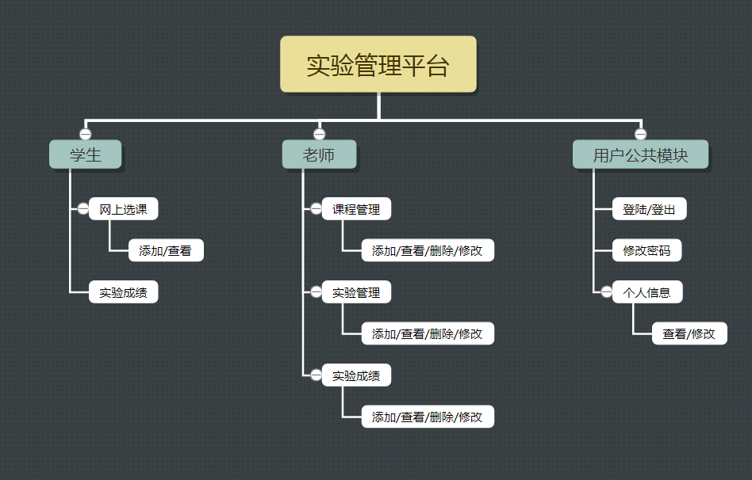
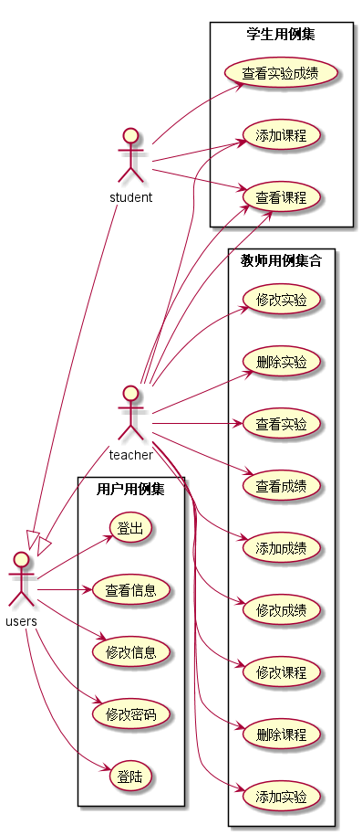
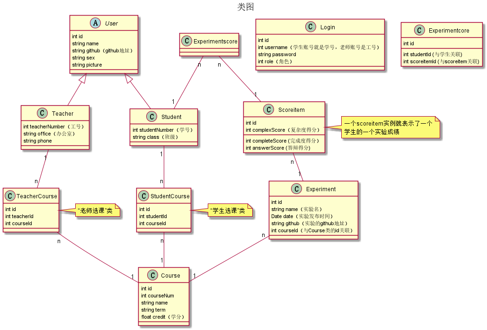
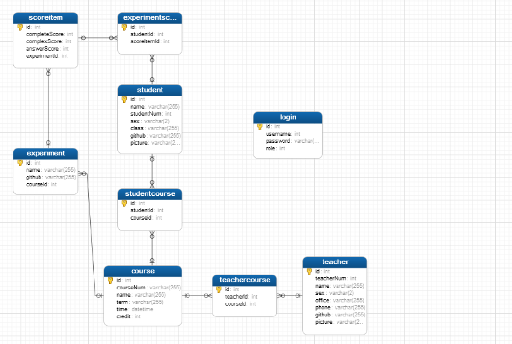

<!-- markdownlint-disable MD033-->
<!-- 禁止MD033类型的警告 https://www.npmjs.com/package/markdownlint -->

# 基于GitHub的实验管理平台的分析与设计

### 成都大学信息科学与工程学院

|学号|班级|姓名|照片|
|:-------:|:-------------: | :----------:|:---:|
|201510414123|软件(本)15-1|吴艳芳||

## 1. 概述
- 基于GitHub的实验管理平台的作用是在线管理实验成绩的Web应用系统。学生和老师的实验内容均存放在GitHUB
页面上。
- 学生的功能主要有：修改个人资料密码等，还可以网上选课，查看自己的实验成绩
- 老师的功能主要有：修改个人资料和密码等，对课程进行CRUD操作管理，以及发布修改实验等，最重要的是对学生的实验成绩打分
 学生每个实验得分都是三项完成度，复杂度以及答辩情况，系统自动计算综合得分
- 老师和学生都能通过本系统的链接方便地跳转到GitHUB，以便批改实验或者查看实验情况。

## 2. 系统总体结构

界面设计参见： 老师 https://sumingshi.github.io/is_analysis/test6/ui/老师.html
               学生 https://sumingshi.github.io/is_analysis/test6/ui/学生.html

## 3. 用例图设计 [源码](src/用例图.puml)

## 4. 类图设计 [源码](src/类图.puml)

## 5. 数据库设计
- ### [参见数据库设计](数据库设计.md)

## 6. 用例及界面详细设计
- ### [“修改学生信息”用例](./用例/修改学生信息.md),[界面](https://sumingshi.github.io/is_analysis/test6/ui/个人资料_1.html)
- ### [“修改实验”用例](./用例/修改实验.md),[界面](https://sumingshi.github.io/is_analysis/test6/ui/实验管理.html)
- ### [“修改教师信息”用例](./用例/修改教师信息.md),[界面](https://sumingshi.github.io/is_analysis/test6/ui/个人资料.html)
- ### [“修改课程”用例](./用例/修改课程.md),[界面](https://sumingshi.github.io/is_analysis/test6/ui/课程管理.html)
- ### [“删除实验”用例](./用例/删除实验.md),[界面](https://sumingshi.github.io/is_analysis/test6/ui/实验管理.html)
- ### [“删除课程”用例](./用例/删除课程.md),[界面](https://sumingshi.github.io/is_analysis/test6/ui/课程管理.html)
- ### [“学生查看成绩”用例](./用例/学生查看成绩.md),[界面](https://sumingshi.github.io/is_analysis/test6/ui/实验成绩_1.html)
- ### [“学生查看课程”用例](./用例/学生查看课程.md),[界面](https://sumingshi.github.io/is_analysis/test6/ui/选课.html)
- ### [“学生添加课程”用例](./用例/学生添加课程.md),[界面](https://sumingshi.github.io/is_analysis/test6/ui/选课.html)
- ### [“查看学生信息”用例](./用例/查看学生信息.md),[界面](https://sumingshi.github.io/is_analysis/test6/ui/个人资料_1.html)
- ### [“查看实验”用例](./用例/查看实验.md),[界面](https://sumingshi.github.io/is_analysis/test6/ui/实验管理.html)
- ### [“查看成绩”用例](./用例/查看成绩.md),[界面](https://sumingshi.github.io/is_analysis/test6/ui/实验成绩.html)
- ### [“查看老师信息”用例](./用例/查看老师信息.md),[界面](https://sumingshi.github.io/is_analysis/test6/ui/个人资料.html)
- ### [“添加实验”用例](./用例/添加实验.md),[界面](https://sumingshi.github.io/is_analysis/test6/ui/实验管理.html)
- ### [“添加成绩”用例](./用例/添加成绩.md),[界面](https://sumingshi.github.io/is_analysis/test6/ui/实验成绩.html)
- ### [“登出”用例](./用例/登出.md),[界面](https://sumingshi.github.io/is_analysis/test6/ui/老师.html)
- ### [“登陆”用例](./用例/登陆.md),[界面](https://sumingshi.github.io/is_analysis/test6/ui/主页.html)

## 7. 数据库关系

