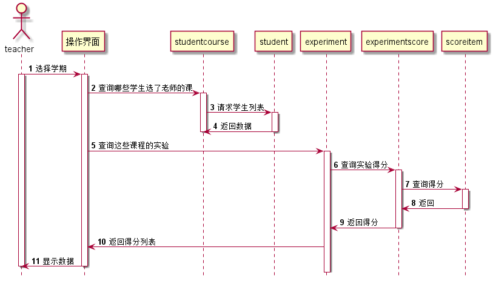

<!-- markdownlint-disable MD033-->
<!-- 禁止MD033类型的警告 https://www.npmjs.com/package/markdownlint -->

# “查看成绩”用例 [返回](../README.md)
## 1. 用例规约

|用例名称|老师查看成绩|
|-------|:-------------|
|功能|查看成绩|
|参与者|老师|
|前置条件|必须先登录|
|后置条件| |
|主事件流| |
|备选事件流| |

## 2. 业务流程 [源码](../src/查看成绩.puml)

## 3. 界面设计
- 界面参照: https://sumingshi.github.io/is_analysis/test6/ui/实验成绩.html
- API接口调用
    - 接口1：[teacherLookScore](../接口/teacherLookScore.md)

## 4. 算法描述
无

## 5. 参照表
- [studentcourse](../数据库设计.md/#electivecourse)
- [course](../数据库设计.md/#course)
- [experiment](../数据库设计.md/#experiment)
- [experimentscore](../数据库设计.md/#score)
- [student](../数据库设计.md/#student)
- [scoreitem](../数据库设计.md/#scoreitem)